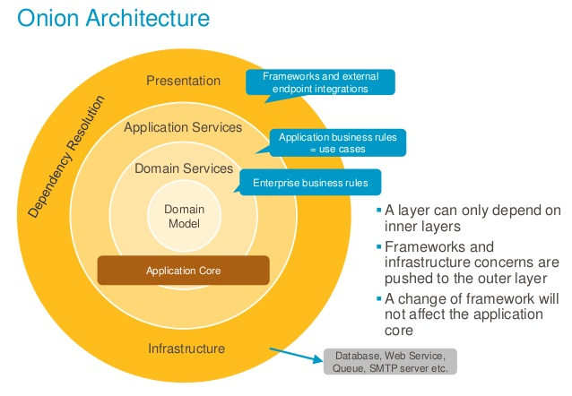
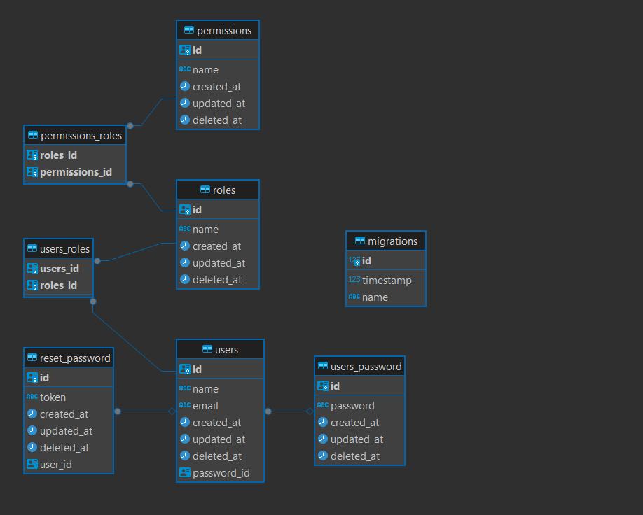

# Nestjs boilerplate Monorepo API

[![node version][node-image]][node-url]

[node-image]: https://img.shields.io/badge/node.js-%3E=_18.0-green.svg?style=flat-square
[node-url]: http://nodejs.org/download/

In this monorepo I used the best architecture concepts: Onion Architecture, DDD and Ports and Adapters.

| Statements                                                                               | Branches                                                                             | Functions                                                                              | Lines                                                                          |
| ---------------------------------------------------------------------------------------- | ------------------------------------------------------------------------------------ | -------------------------------------------------------------------------------------- | ------------------------------------------------------------------------------ |
|  |  |  |  |

### Building and Running the application

- install dependencies
  ```
  yarn install:dev
  ```
- up infra
  ```
  yarn infra
  ```
- run migrations
  ```
  yarn migration:run
  ```

---

### Apps running

- auth

  ```
  yarn start:auth
  ```

- user

  ```
  yarn start:user
  ```

- cat
  ```
  yarn start:cat
  ```

### Postgres migrations

- create
  ```
  $ yarn migration-postgres:create
  ```
- run

  ```
  $ yarn migration-postgres:run
  ```

### Mongo migrations

- create
  ```
  $ yarn migration-mongo:create
  ```
- run

  ```
  $ yarn migration-mongo:run
  ```

### Test

- run
  ```
  $ yarn test
  ```
- coverage
  ```
  $ yarn test:cov
  ```

### Lint

- lint
  ```
  $ yarn lint
  ```
- prettier
  ```
  $ yarn prettier
  ```

### snippets

```
usecase
```

```
apitest
```

```
docs
```

### Architecture diagram

## 

[Architecture documentation](https://jeffreypalermo.com/2008/07/the-onion-architecture-part-1/)

### User diagram



### Microservice architecture.

- I18n
- Docker
- Observability
  - tracing
  - logs
  - metrics
- Lint-staged + Husky
- Commitlint
- Secrets Service
- HTTP Service
- Logger Service
  - mongodb transport
- Authentication
  - Login
  - Logout
  - Forgot Password
  - Refresh Token
- Authorization
  - Role-based access
  - Endpoint Permissions
- Error Handler
- Libs Structure
- Dependency Inversion Pattern
- Usecase Pattern
- Interface Adapter Pattern
- Generic Repository Pattern
  - Mongo Repository (mongoose)
  - Postgres Repository (TypeORM)
- Swagger Documentation
- Cache Service
  - Redis
  - NodeCache
- Database
  - mongo
    - Migrations
  - postgres
    - Migrations
- Tests
  - unit
  - 100% coverage

---

The following is a list of all the people that have contributed Nestjs monorepo boilerplate. Thanks for your contributions!

[](https://github.com/mikemajesty)

## License

It is available under the MIT license.
[License](https://opensource.org/licenses/mit-license.php)
